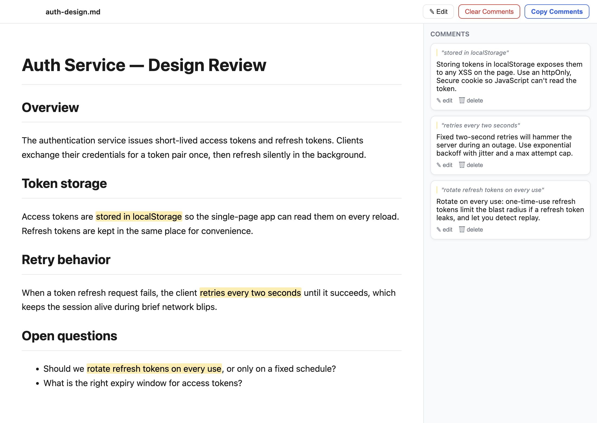

<div align="center">


# md-reviewer

**Review Markdown like a pull request — highlight passages, leave comments in a sidebar, and copy the whole set out for your coding agent in one click.**

[](LICENSE)


</div>

<p align="center">
  
</p>

LLMs write a lot of Markdown — specs, plans, designs, PRDs. Reviewing them in a
text editor is awkward, and reviewing them in a browser preview gives you no way
to leave feedback. **md-reviewer** opens a `.md` file as a clean rendered
document, lets you highlight any passage and attach a comment, then copies every
comment out in a format you can paste straight back to a coding agent.

No accounts, no cloud, no telemetry. Comments live in a small JSON file next to
your document and re-anchor themselves to the text even after it changes.

## Hand your review to a coding agent

Click **Copy Comments** and every comment lands on your clipboard as plain text,
each one tied to the exact passage you highlighted:

```text
Comments:
- "stored in localStorage" <-- Storing tokens in localStorage exposes them to any XSS on the page. Use an httpOnly, Secure cookie so JavaScript can't read the token.
- "retries every two seconds" <-- Fixed two-second retries will hammer the server during an outage. Use exponential backoff with jitter and a max attempt cap.
- "rotate refresh tokens on every use" <-- Rotate on every use: one-time-use refresh tokens limit the blast radius if a refresh token leaks, and let you detect replay.
```

Paste that straight into your terminal and let your coding agent — Claude Code,
Codex, Cursor, Aider — act on it. Because each note quotes the text it refers to,
the agent knows exactly which passages you meant without you re-explaining them.

## Features

- **Highlight → comment** — select rendered text and leave a margin comment, like a code review.
- **One-click copy** — export all comments as agent-ready text for Claude Code, Cursor, ChatGPT, etc.
- **Edit in place** — toggle a CodeMirror editor (`⌘S` to save) without leaving the app.
- **Durable anchoring** — comments re-attach to their passage after edits; if the text changed too much they're flagged "couldn't locate" but never dropped.
- **Plain-file storage** — comments save to `<dir>/.md-reviewer/<file>.comments.json`. Diff it, commit it, delete it. Your call.
- **GFM + syntax highlighting** — tables, task lists, and fenced code blocks via `remark-gfm` and `highlight.js`.
- **Local and private** — no network calls, strict Content-Security-Policy, sandboxed renderer.

## Install

Requires [Node.js](https://nodejs.org) 18+ and macOS (Apple Silicon).

```bash
git clone https://github.com/TN0123/md-reviewer.git
cd md-reviewer
npm install
npm run dist
cp -R "dist/mac-arm64/md-reviewer.app" /Applications/
```

### Make it the default app for `.md`

Finder → right-click any `.md` file → **Get Info** → **Open with** → md-reviewer → **Change All…**

macOS doesn't let an app claim this automatically, so this one-time step is required.

## Develop

```bash
npm run dev     # launch in dev mode with hot reload
npm test        # run the unit tests (Vitest)
npm run build   # type-check + bundle
```

## How it works

Three layers behind a typed bridge:

- **Main** (`src/main`) — Electron process: windows, file I/O, `.md` association, sidecar persistence.
- **Renderer** (`src/renderer`) — React UI: preview, on-demand editor, comments rail, toolbar.
- **Preload** (`src/preload`) — the only channel between them; the renderer has no Node access.

The interesting part is **anchoring**. A comment stores its quoted text plus a
bit of surrounding context, not just character offsets. When you reopen a file,
each comment is re-located by exact match first, then by fuzzy match
([`diff-match-patch`](https://github.com/google/diff-match-patch)) — so comments
stay put through edits, and the offset-conversion and re-anchoring logic is
covered by unit tests.

## Tech

Electron · React 18 · TypeScript · CodeMirror 6 · react-markdown · remark-gfm · rehype-highlight · diff-match-patch · Vitest

## Contributing

Issues and PRs are welcome. Run `npm test` before opening a PR.

## License

[MIT](LICENSE) © Tanay Naik
